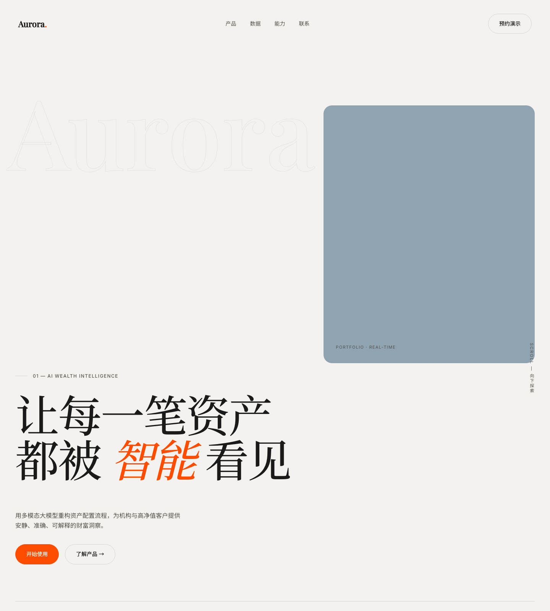
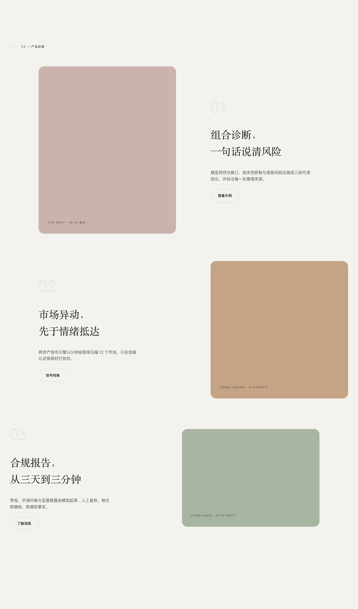
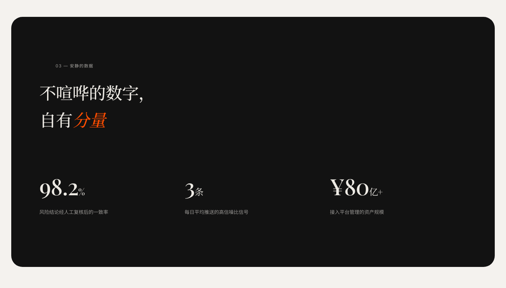
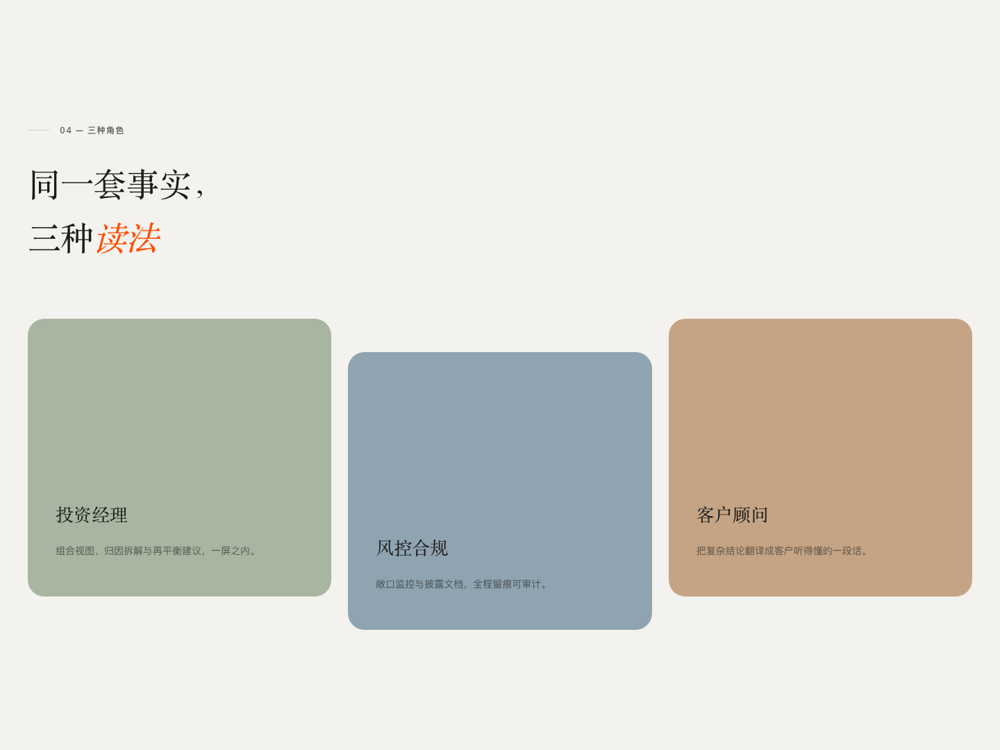
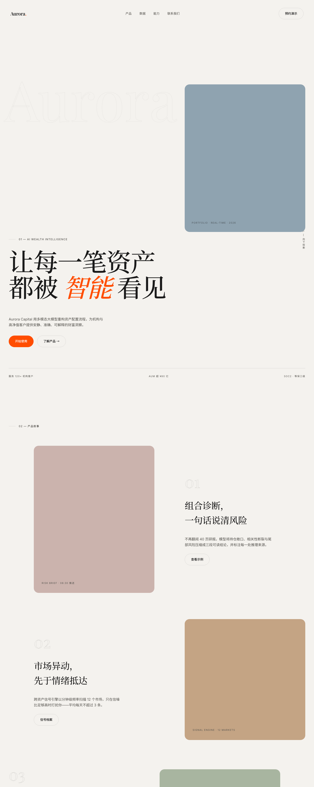
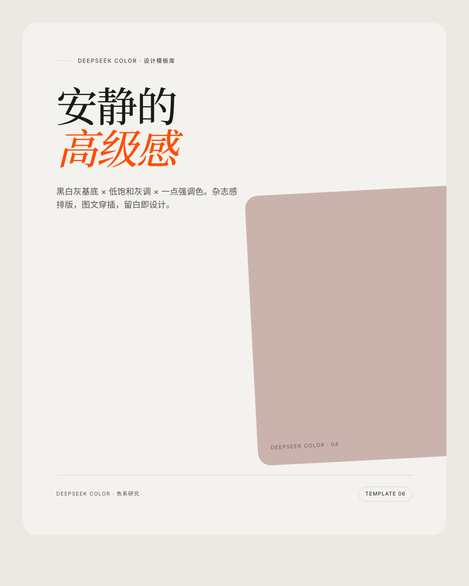
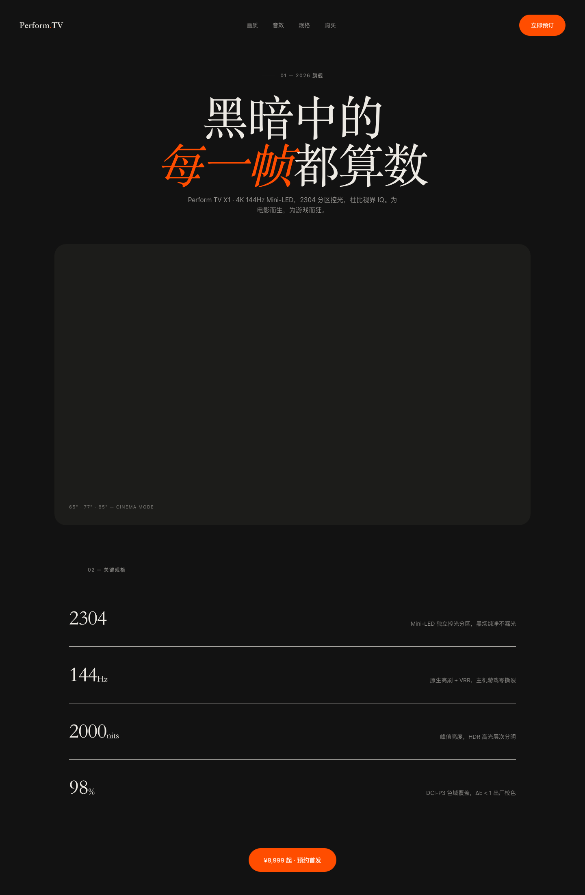
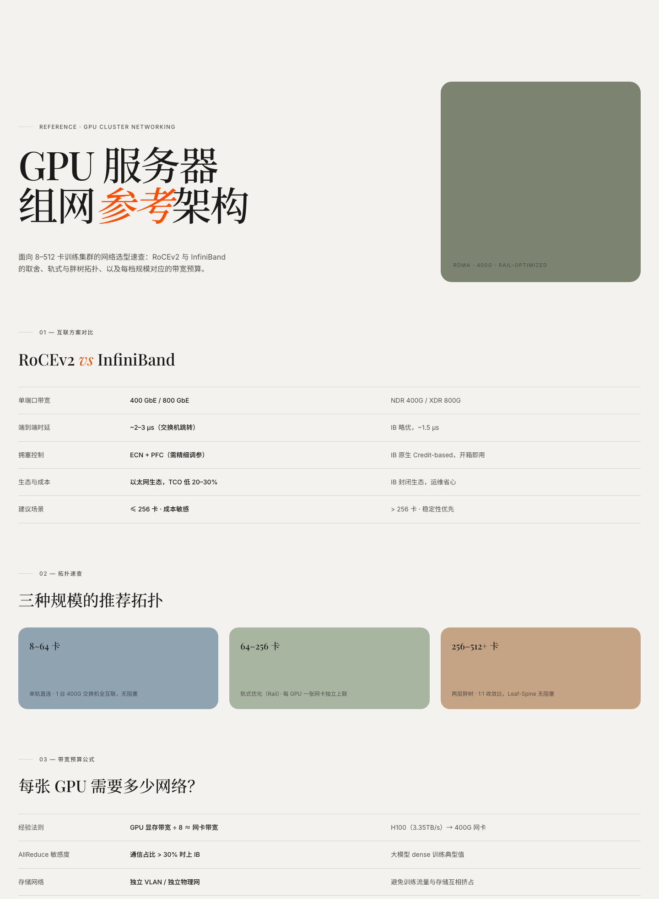
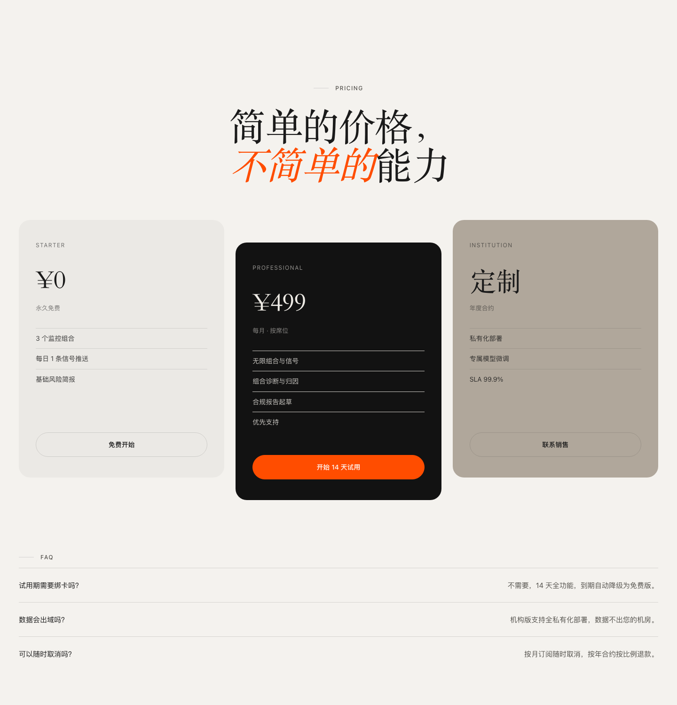
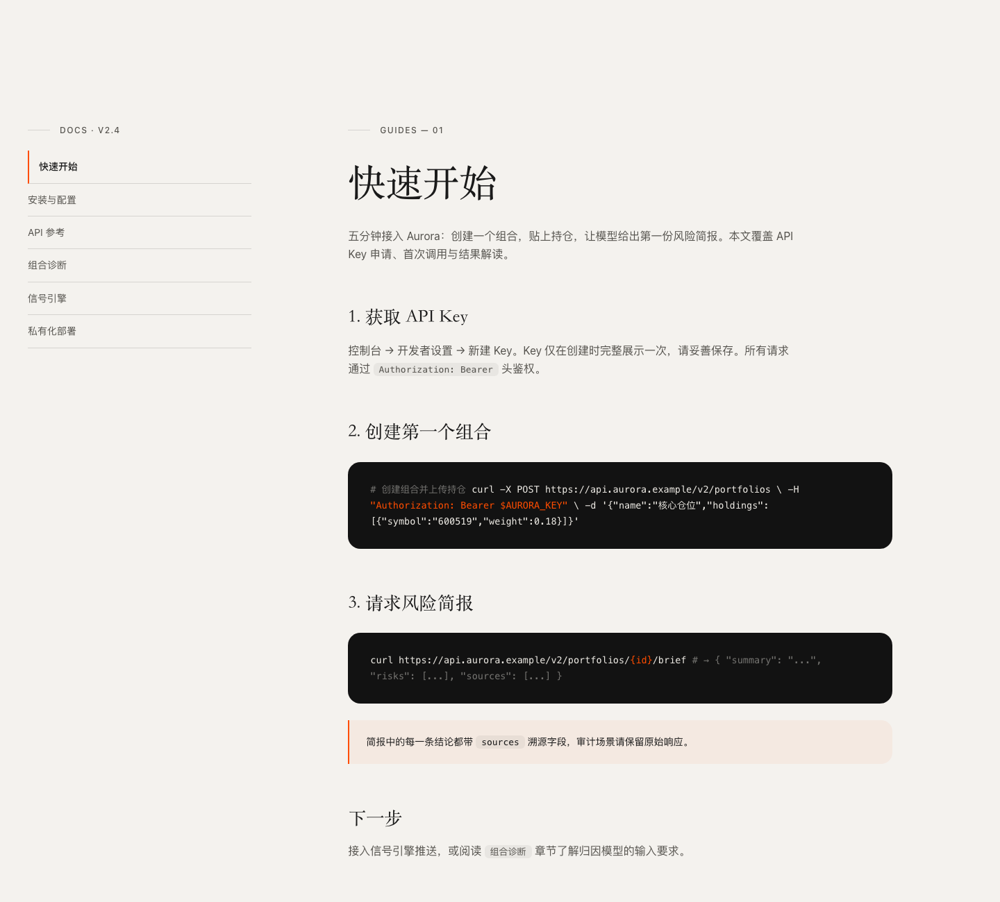

# Slava Style — AI Agent 设计技能

复刻设计师 **Slava Kornilov**（Geex Arts 创意总监）的视觉风格，沉淀成一份可直接安装的 AI Agent Skill：杂志感排版 × 莫兰迪低饱和配色 × 黑白灰高级基底 × 一点强调色。

适配官网、金融、AI 产品等需要「轻奢、干净、专业」气质的场景。

## 设计原则

| 原则 | 做法 |
|---|---|
| 基底优先，强调唯一 | 70–85% 黑白灰基底 + 10–25% 莫兰迪灰调 + <5% 单一强调色 |
| 排版即主角 | 超大展示标题（clamp 48–120px）、紧字距、一句话内混字重/斜体 |
| 破格式布局 | 图文穿插、错位一栏、元素出血，保留隐形对齐轴 |
| 留白即组件 | 每个区块留 30–50% 空白 |
| 轻量组件 | 发丝描边、大圆角、无阴影、胶囊按钮 |
| 克制动效 | 慢速淡入、轻微视差，拒绝弹跳 |

## 模板库（10 个）

所有模板位于 `templates/`，浏览器直接打开 HTML 即可预览；`previews/` 是对应的渲染图。

| # | 模板 | 预览 | 适用场景 |
|---|---|---|---|
| 01 | Hero Editorial 首屏 |  | 官网/产品首屏：超大标题 + 强调词 + 出血图片 + 描边装饰字 |
| 02 | Editorial Feed 图文流 |  | 产品叙事、博客列表：左右交错、描边序号、变化比例图片 |
| 03 | Stats Dark 深色数据 |  | 数据展示：深色区块 + 衬线大数字 + 发丝分隔线 |
| 04 | Offset Cards 错位卡片 |  | 特性/角色介绍：莫兰迪色卡片、错位排布、零阴影 |
| 05 | Landing Full 完整落地页 |  | 完整官网：01–04 的组合 + CTA + 页脚 |
| 06 | Social Poster 社媒海报 |  | 小红书/公众号封面：4:5 竖版、旋转色块、强调词标题 |
| 07 | Perform TV 产品页 |  | 消费电子/硬件发布：全深色、居中巨标题、规格行大数字 |
| 08 | GPU Networking 参考页 |  | 技术参考/选型指南：对比表 + 拓扑色块 + 公式行 |
| 09 | Pricing 定价页 |  | SaaS 定价：中间深色主推卡错位下沉 + FAQ 发丝行 |
| 10 | Docs Reference 文档页 |  | 开发者文档：粘性侧导航 + 深色代码块 + 强调色提示条 |

## 目录结构

```
slava-style/
├── SKILL.md               # 技能定义：触发描述 + 设计原则 + 反模式
├── references/
│   └── tokens.md          # 色板、字体阶梯、招牌手法、间距规范
├── assets/
│   └── base.css           # 可直接引用的变量与组件类（sv-display / sv-kicker / sv-card--* …）
└── templates/
    ├── 01-hero-editorial.html … 10-docs-reference.html
    └── previews/*.png
```

## 快速使用

模板 HTML 通过相对路径引用 `assets/base.css`，换项目时：

1. 改 `--accent` 一个变量即可切换全站强调色（橙红 `#FF4D00` / 钴蓝 `#2B4EFF` / 荧光黄 `#D8FF3E`）
2. 莫兰迪色卡直接用类名：`sv-card--sage` / `sv-card--dusty` / `sv-card--terra` / `sv-card--blush`
3. 深色区块加 `sv-dark` 类

## 安装为 Agent Skill

- **Kimi Work**：把 `slava-style.skill`（zip 包）拖入或放入技能目录
- **Codex**：复制 `slava-style/` 到 `~/.codex/skills/`
- **Claude Code**：复制到 `~/.claude/skills/`
- **Workbuddy**：复制到 `~/.workbuddy/skills/`

之后对 agent 说「用 Slava 风格做一页官网」「莫兰迪配色的落地页」即可自动触发。

## 风格来源

风格研究自设计师 Slava Kornilov（[Dribbble](https://dribbble.com/) 搜索 "Slava Kornilov"）。本仓库为风格学习与工程化沉淀，非官方作品。
