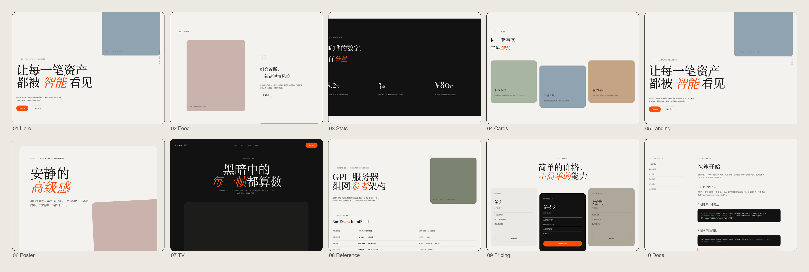
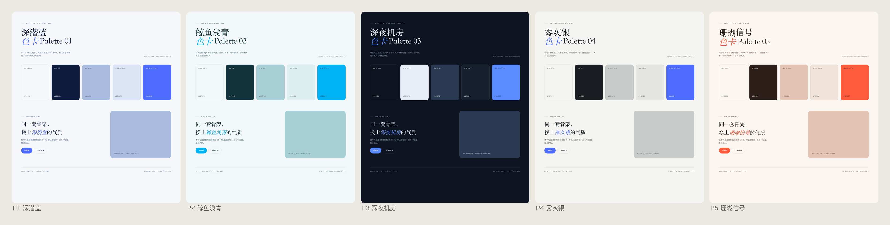
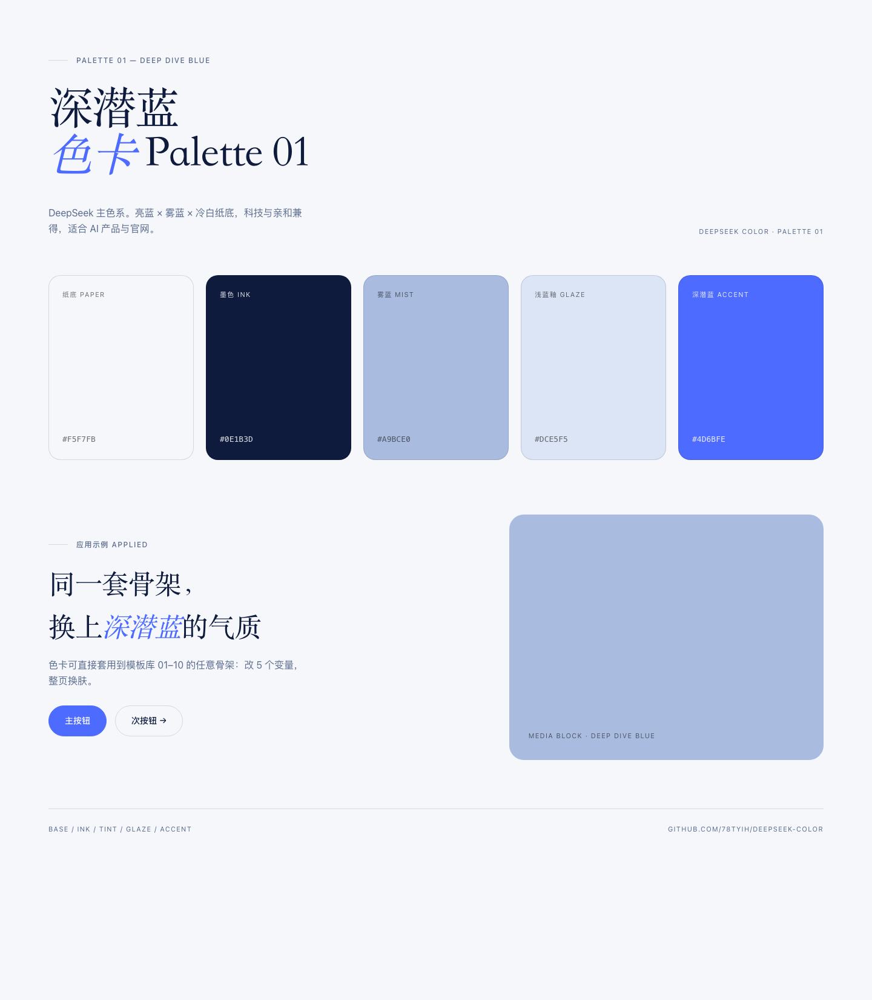
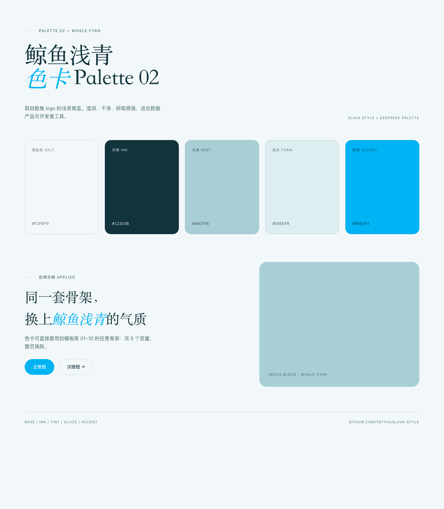
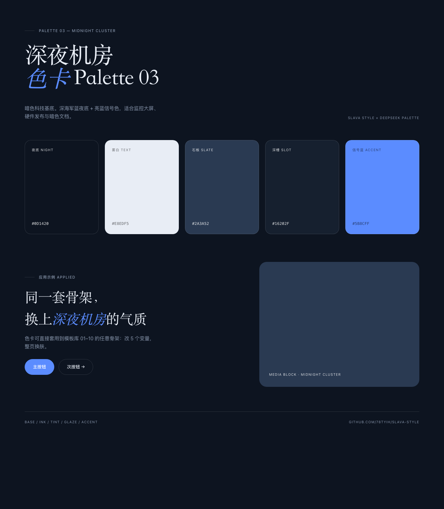
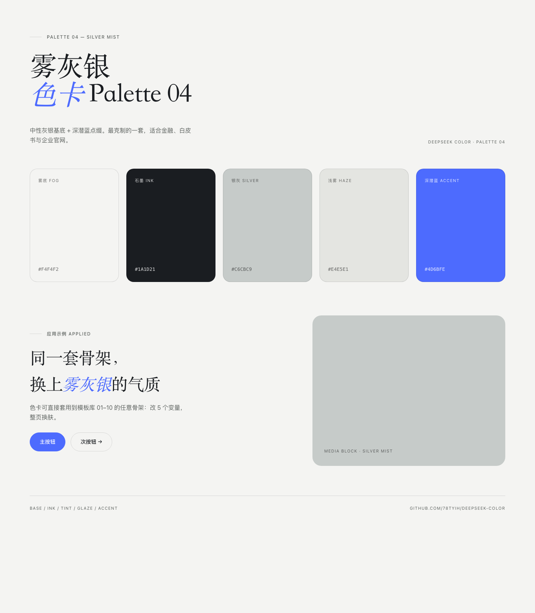
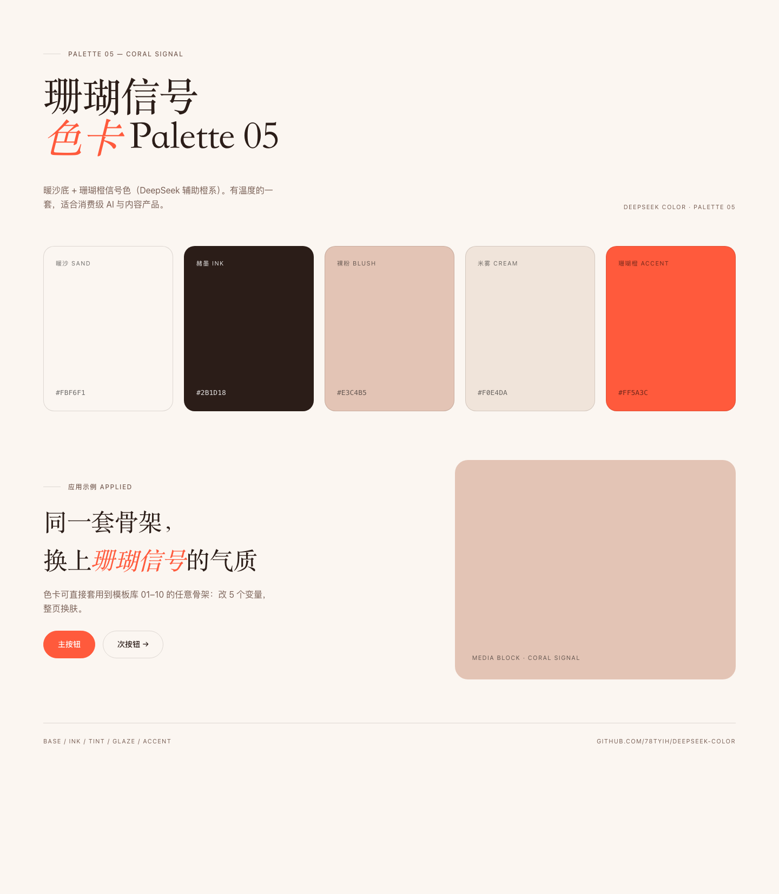
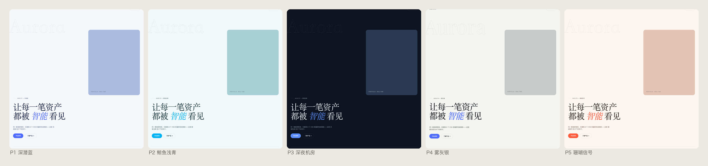
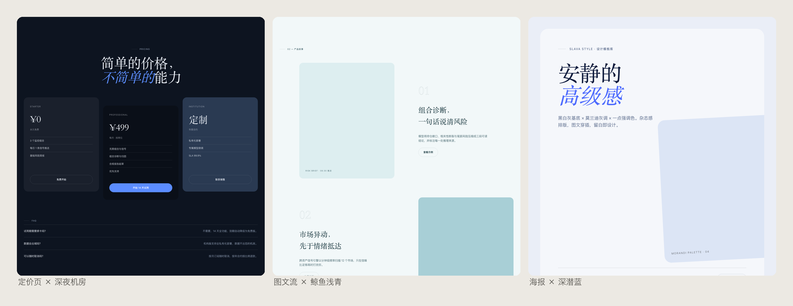

# DeepSeek Color — AI Agent 设计技能



以 **DeepSeek 品牌色系**为核心的设计系统：明亮柔和的品牌蓝、鲸鱼浅青、珊瑚信号橙，落在黑白灰高级基底上，配杂志感排版与破格式布局——不堆砌花哨色彩，不靠特效博眼球，靠色彩平衡营造轻奢、干净、专业的视觉氛围。

适配官网、金融、AI 产品等场景，可直接安装为 AI Agent Skill。

**在线预览（GitHub Pages，无需下载）：** [交互展示页](https://78tyih.github.io/deepseek-color/showcase.html)（五色卡 + 八套换肤在线试穿）· [首屏骨架](https://78tyih.github.io/deepseek-color/templates/01-hero-editorial.html) · [色卡规范页 P1](https://78tyih.github.io/deepseek-color/palettes/p1-deep-dive-blue.html) —— 12 个骨架与 5 张色卡页全部可在线打开，链接格式 `https://78tyih.github.io/deepseek-color/templates/<文件名>`。

## 五大色卡（DeepSeek Color 色系）



色系灵感全部来自 DeepSeek 的品牌视觉：主品牌蓝 `#4D6BFE`、鲸鱼 logo 的浅亮青、品牌辅助橙系。归纳为五套完整色卡，每套含「基底 / 墨色 / 灰调 / 浅釉 / 强调」五色，遵循统一配色纪律（基底 70–85% / 灰调 10–25% / 强调 <5%）。展示页位于 `templates/palettes/`。

| # | 色卡 | 基底 / 墨色 / 灰调 / 强调 | 气质与场景 |
|---|---|---|---|
| P1 | 深潜蓝 Deep Dive Blue | `#F5F7FB` / `#0E1B3D` / `#A9BCE0` / `#4D6BFE` | DeepSeek 主色系，AI 产品与官网首选 |
| P2 | 鲸鱼浅青 Whale Cyan | `#F2F8F9` / `#12333B` / `#A8CFD6` / `#00B3F4` | 湿润呼吸感，数据产品与开发者工具 |
| P3 | 深夜机房 Midnight Cluster | `#0D1420` / `#E8EDF5` / `#2A3A52` / `#5B8CFF` | 暗色科技，监控大屏与硬件发布 |
| P4 | 雾灰银 Silver Mist | `#F4F4F2` / `#1A1D21` / `#C6CBC9` / `#4D6BFE` | 最克制的中性灰，金融与企业官网 |
| P5 | 珊瑚信号 Coral Signal | `#FBF6F1` / `#2B1D18` / `#E3C4B5` / `#FF5A3C` | 暖沙 + 珊瑚橙，消费级 AI 与内容产品 |

每套色卡的展示页：    

### 同一骨架 × 五套皮肤

把五套色卡分别套到「01 首屏」骨架上的换肤对比（页面在 `templates/skins/`，每页只改 6 个 CSS 变量）：



### 任意骨架 × 任意色卡

换肤是通用的：在骨架 HTML 里注入一段色卡变量覆盖即可完成。三个组合演示（`templates/skins/`）：



## 设计原则

| 原则 | 做法 |
|---|---|
| 基底优先，强调唯一 | 70–85% 黑白灰基底 + 10–25% 低饱和灰调 + <5% 单一强调色 |
| 排版即主角 | 超大展示标题（clamp 48–120px）、紧字距、一句话内混字重/斜体 |
| 破格式布局 | 图文穿插、错位一栏、元素出血，保留隐形对齐轴 |
| 留白即组件 | 每个区块留 30–50% 空白 |
| 轻量组件 | 发丝描边、大圆角、无阴影、胶囊按钮 |
| 克制动效 | 慢速淡入、轻微视差，拒绝弹跳 |

## 模板库（10 个骨架）

所有骨架位于 `templates/`，浏览器直接打开 HTML 即可预览；`previews/` 是对应的渲染图。

| # | 模板 | 预览 | 适用场景 |
|---|---|---|---|
| 01 | Hero Editorial 首屏 |  | 官网/产品首屏：超大标题 + 强调词 + 出血图片 + 描边装饰字 |
| 02 | Editorial Feed 图文流 |  | 产品叙事、博客列表：左右交错、描边序号、变化比例图片 |
| 03 | Stats Dark 深色数据 |  | 数据展示：深色区块 + 衬线大数字 + 发丝分隔线 |
| 04 | Offset Cards 错位卡片 |  | 特性/角色介绍：灰调色卡片、错位排布、零阴影 |
| 05 | Landing Full 完整落地页 |  | 完整官网：01–04 的组合 + CTA + 页脚 |
| 06 | Social Poster 社媒海报 |  | 小红书/公众号封面：4:5 竖版、旋转色块、强调词标题 |
| 07 | Perform TV 产品页 |  | 消费电子/硬件发布：全深色、居中巨标题、规格行大数字 |
| 08 | GPU Networking 参考页 |  | 技术参考/选型指南：对比表 + 拓扑色块 + 公式行 |
| 09 | Pricing 定价页 |  | SaaS 定价：中间深色主推卡错位下沉 + FAQ 发丝行 |
| 10 | Docs Reference 文档页 |  | 开发者文档：粘性侧导航 + 深色代码块 + 强调色提示条 |

## 目录结构

```
deepseek-color/
├── SKILL.md               # 技能定义：触发描述 + 设计原则 + 色卡 + 换肤工作流
├── references/
│   └── tokens.md          # 五大色卡 CSS 变量、字体阶梯、招牌手法、间距规范
├── assets/
│   └── base.css           # 可直接引用的变量与组件类（sv-display / sv-kicker / sv-card--* …）
└── templates/
    ├── 01-hero-editorial.html … 10-docs-reference.html   # 10 个版式骨架
    ├── previews/*.png                                    # 骨架渲染图 + 总览横幅
    ├── palettes/p1-*.html … p5-*.html                    # 五大色卡展示页
    └── skins/                                            # 骨架 × 色卡换肤实例
```

## 快速使用

模板 HTML 通过相对路径引用 `assets/base.css`，换肤只需覆盖变量：

1. 改 `--accent` 一个变量即可切换全站强调色
2. 套用完整色卡：从 `references/tokens.md` 复制对应色卡的 6 个变量组覆盖 `:root`
3. 深色区块加 `sv-dark` 类

## 安装为 Agent Skill

- **Kimi Work**：把 `deepseek-color.skill`（zip 包）拖入或放入技能目录
- **Codex**：复制 `deepseek-color/` 到 `~/.codex/skills/`
- **Claude Code**：复制到 `~/.claude/skills/`
- **Workbuddy**：复制到 `~/.workbuddy/skills/`

之后对 agent 说「用 DeepSeek Color 做一页官网」「深夜机房色卡的定价页」即可自动触发。

## 四问速览

| 问 | 答 |
|---|---|
| **解决什么问题** | AI 生成的网页普遍「AI 感过强」——花哨渐变、玻璃拟态、霓虹配色。本技能把配色纪律（70/25/5）与杂志排版规则写成 Agent 可执行的规范 |
| **什么场景 → 什么结果** | 「用深潜蓝做官网首屏」→ 克制的专业页；「换午夜机房色卡」→ 暗色科技页；已有页面改 `--accent` 一个变量全站换色 |
| **什么结构** | `SKILL.md`（触发+规则）→ `references/tokens.md`（变量/字体阶梯/间距）→ `assets/base.css` + `templates/*.html`（零依赖骨架），换肤 = 变量覆盖 |
| **能复用什么** | ① 整包复制进 Kimi/Codex/Claude Code/WorkBuddy skills 目录即用；② 12 个单文件骨架改文案即成品；③ 70/25/5 配色纪律不绑定 DeepSeek 色系，任何色系可套 |

## 说明

色系灵感来自 DeepSeek 品牌视觉（明亮柔和的品牌蓝与鲸鱼意象配色）。本仓库为设计系统的工程化沉淀，与 DeepSeek 官方无关联。
